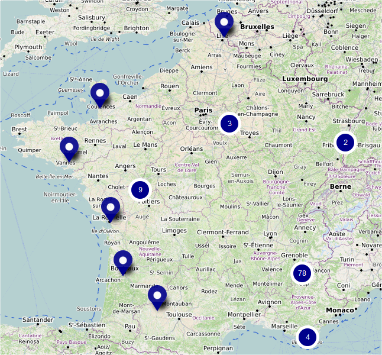

# Supplier map
> Generate CSV files to import in umap to have a supplier map from a supplier table 

## Purpose

- Get the CSV table containing some data about entities (for example the suppliers of
[L'Éléfàn](https://lelefan.org/))
- Transform addresses to coordinates
- Export a CSV directly usable in [umap](http://umap.openstreetmap.fr/fr/)




### Basic User Installation

#### Windows

- [Download the archive containing an executable](https://github.com/elefan-grenoble/supplier_map/releases/download/v1.0.0/supplier_map_v_1_0_0.zip)
- Extract the archive

#### Linux/Mac

Will be available if asked

### Contributor Installation (whatever the OS)

If you want contribute to the project or use it on Linux/Max, you should install Python
and dependencies of the project by one of these ways.

#### Conda (recommended)

[Install conda](https://docs.conda.io/en/latest/miniconda.html)

Create a conda environment
````
conda create -n supplier_map python=3.6
````

Activate the conda environment
````
activate supplier_map
````

Install the packages with the following command
````
conda install geopy numpy pandas tqdm
````

#### Pip
Install Python (you can install conda for example).

Run the following command which will be add depencies in the current environment.
````
pip install -r requirements.txt
````

#### Optional

If you want release your development, you can use the Pyinstaller package.

There is currently an issue in the latest release of Pyinstaller
which is fixed in the develop branch. To install it, run the following command.

````
pip install https://github.com/pyinstaller/pyinstaller/tarball/develop 
````

To generate an updated version of the .exe file, run the following command
````
pyinstaller source/main/manage_supplier_data.py -F
````

The *.exe* file will be find in the dist directory.

You should just update the *.exe* file in the archive of the release.

### Usage
#### Windows

For L'Éléfàn members, there is [a wiki page](https://wiki.lelefan.org/index.php?title=Produits/Carte_des_Producteurs_et_Fournisseurs) 
written in French to explain usage and more.

* Open *update_supplier_map.bat* with a text editor.
* Replace *Table_fournisseurs_2019_10.csv* by the name of the file containing
all the supplier data which is in the data directory.
* Save your editions
* Double click on *update_supplier_map.bat*

If there was no issue, the CSV file *data/umap_filtered.csv* has been updated.

You can import this CSV file in umap.


#### Linux/Mac

Will be available if asked

#### Contributor (whatever the OS)

Add the root directory in the PYTHONPATH :

- Windows : ```set PYTHONPATH=%PYTHONPATH%;%cd%```
- Linux/Mac : ```set PYTHONPATH=$PYTHONPATH;pwd```

Run the following command to know the parameters.

````
python source/main/manage_supplier_data.py -h
````

## License

Supplier map is released under the [MIT License](http://www.opensource.org/licenses/MIT).
